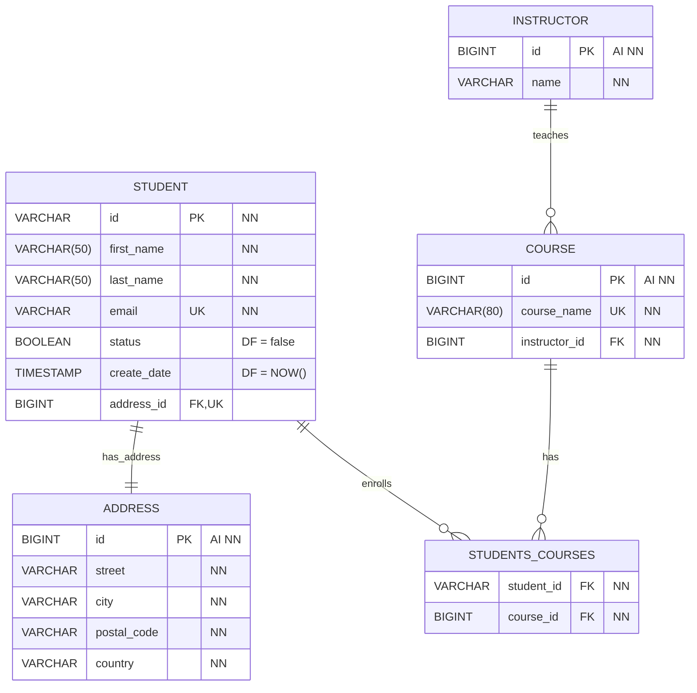

```mermaid

erDiagram
    STUDENT {
        VARCHAR id PK "NN"
        VARCHAR(50) first_name "NN"
        VARCHAR(50) last_name "NN"
        VARCHAR email UK "NN"
        BOOLEAN status "DF = false"
        TIMESTAMP create_date "DF = NOW()"
        BIGINT address_id FK, UK
    }

    ADDRESS {
        BIGINT id PK "AI NN"
        VARCHAR street "NN"
        VARCHAR city "NN"
        VARCHAR postal_code "NN"
        VARCHAR country "NN"
    }

    INSTRUCTOR {
        BIGINT id PK "AI NN"
        VARCHAR name "NN"
    }

    COURSE {
        BIGINT id PK "AI NN"
        VARCHAR(80) course_name UK "NN"
        BIGINT instructor_id FK "NN"
    }

    STUDENTS_COURSES {
        VARCHAR student_id FK "NN"
        BIGINT course_id FK "NN"
    }

%% Relationships
    STUDENT ||--|| ADDRESS: has_address
    INSTRUCTOR ||--o{ COURSE: teaches

    STUDENT ||--o{ STUDENTS_COURSES: enrolls
    COURSE ||--o{ STUDENTS_COURSES: has
```